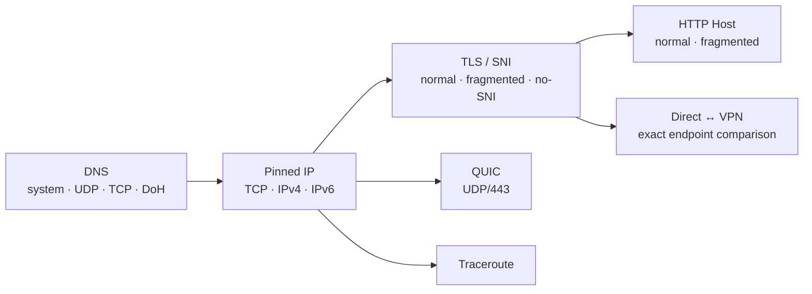

<div align="center">

# netprobe-agent

**Послойная диагностика DNS, TCP/IP, TLS/SNI, HTTP Host, QUIC и маршрутов — с доказательными выводами вместо гадания по одному timeout.**

[](https://github.com/gon7187/netprobe-agent/actions/workflows/ci.yml)
[](https://www.python.org/)
[](https://github.com/gon7187/netprobe-agent)
[](LICENSE)

</div>

`netprobe` — stdlib-only Python-инструмент для послойной диагностики сетевой
доступности и вероятной фильтрации. Он идёт по цепочке:



Главный принцип: один timeout, RST, другой CDN-IP или `*` в traceroute не
называются «DPI». Инструмент сохраняет сырые факты в JSON, делает осторожные
выводы `inconclusive`/`suspected`, а высокую уверенность получает из
дифференциальных проверок на одном endpoint:

- обычный TLS ClientHello против того же ClientHello с SNI, разделённым между
  TCP-сегментами;
- обычный HTTP Host против разделённого между TCP-сегментами;
- прямой путь против VPN на том же exact `IP:port` и варианте пробы.

## Что проверяется

- системный DNS, прямой DNS/UDP, DNS/TCP и два DNS-over-HTTPS;
- NXDOMAIN/SERVFAIL/REFUSED, разные ответы, special-use/private ответы;
- IPv4 и IPv6 отдельно;
- TCP 80/443 и порт из URL, включая timeout/refused/reset/unreachable;
- TLS с целевым SNI, фрагментированным SNI, без SNI, TLS 1.2, TLS 1.3;
- стандартная проверка цепочки и hostname сертификата;
- HTTP по фиксированному IP с правильным Host, без follow-redirect;
- явные fingerprints поддерживаемых страниц блокировки и HTTP 451;
- QUIC Version Negotiation по UDP/443 без сторонних библиотек;
- системный `tracert`/`traceroute` с локализационно-независимым парсером;
- точные VPN-кандидаты `/32` и `/128` и безопасный managed route-файл;
- сравнение `direct`/`vpn` отчётов только на совпавших endpoint.

## Установка

Требуется Python 3.11+; runtime-зависимостей нет.

```powershell
uv sync --extra dev
uv run netprobe doctor
```

Без установки тоже можно:

```powershell
$env:PYTHONPATH = "src"
python -m netprobe doctor
```

## Основные команды

Полная диагностика с человекочитаемым итогом и JSON-артефактом:

```powershell
uv run netprobe diagnose https://example.com `
  --json-out artifacts/example-direct.json `
  --path-label direct
```

Короткий запуск без traceroute:

```powershell
uv run netprobe diagnose example.com --quick --no-trace
```

JSON для ИИ-агента — единственный документ в stdout, прогресс идёт в stderr:

```powershell
uv run netprobe diagnose example.com --json > report.json
```

Трассировка. Сначала имя резолвится, затем `tracert` получает только проверенный
числовой IP одним argv-элементом; shell не используется:

```powershell
uv run netprobe trace example.com --family both --json
```

### Прямой путь против VPN

Сначала без VPN:

```powershell
uv run netprobe diagnose blocked.example `
  --no-trace --path-label direct `
  --json-out artifacts/blocked-direct.json
```

Затем включить VPN и повторить. Важно, чтобы в отчётах были одинаковые IP:

```powershell
uv run netprobe diagnose blocked.example `
  --no-trace --path-label vpn `
  --json-out artifacts/blocked-vpn.json

uv run netprobe compare `
  artifacts/blocked-direct.json `
  artifacts/blocked-vpn.json
```

Если VPN меняет DNS и выбирает другой CDN-IP, `compare` не выдаст ложный
дифференциальный вывод: разные endpoints будут помечены как несопоставимые.

## VPN route-файл

Показать, какие конечные адреса сейчас рекомендуются:

```powershell
uv run netprobe routes suggest example.com --json
```

Добавить/обновить адреса в файле:

```powershell
uv run netprobe routes sync example.com --file vpn-routes.txt --json
```

При первом изменении рядом появится `vpn-routes.txt.netprobe.json`. Sidecar
хранит ownership: `sync` удаляет только устаревшие строки, ранее добавленные
самим `netprobe`, и никогда не присваивает уже существующую ручную строку.
Операции идемпотентны и записываются через временный файл + `fsync` +
`os.replace`; symlink отклоняется.

Удалить записи одной цели или проверить файл:

```powershell
uv run netprobe routes remove example.com --file vpn-routes.txt
uv run netprobe routes validate --file vpn-routes.txt --json
```

### Какие IP добавлять

Добавляются только конечные A/AAAA адреса сервиса:

- IPv4 — `/32`;
- IPv6 — `/128`.

Промежуточные IP из traceroute добавлять нельзя: это роутеры провайдера и
транзита, а не адреса сайта. Нельзя автоматически расширять адрес до ASN/BGP
префикса: CDN и хостинг делят подсети между множеством чужих сервисов.

Статический файл не означает «навсегда» для CDN. IP меняются, поэтому запускайте
`routes sync` по расписанию или перед использованием. Если браузер уходит на
другой hostname, API или CDN, диагностируйте его отдельной целью. Если есть
AAAA, добавьте `/128` и убедитесь, что VPN маршрутизирует IPv6, иначе приложение
может обойти IPv4 `/32`.

## Коды завершения

- `0` — команда выполнена и отчёт сформирован;
- `1` — только `--fail-on-suspected` либо ошибки `routes validate`;
- `2` — неверная цель/аргументы/route-файл;
- `3` — локальная ошибка инструмента;
- `130` — прерывание пользователем.

Сетевой timeout является данными отчёта, а не аварией CLI.

## Ограничения

- Абсолютно все виды фильтрации одним клиентом определить невозможно.
- Без второго запуска через VPN вывод об IP/SNI/HTTP-фильтрации обычно остаётся
  подозрением.
- QUIC-timeout не доказывает блокировку: endpoint может не поддерживать QUIC
  или молча игнорировать Version Negotiation.
- Traceroute обычно использует ICMP/UDP системной утилиты; ICMP может
  фильтроваться при полностью рабочем HTTPS.
- HTTPS Host зашифрован внутри TLS. Проверка фрагментации Host относится к
  открытому HTTP; для HTTPS отдельно анализируются SNI и сертификат.
- ECH скрывает SNI там, где поддерживается клиентом и сервером; stdlib Python не
  даёт управляемого ECH-теста.
- Корпоративный proxy, антивирус, неверное время и split-horizon DNS могут
  выглядеть как вмешательство — они перечисляются как альтернативы.

## Разработка

```powershell
python -m pytest -q
ruff check --fix src tests
ruff format src tests
pyright src tests
```

Unit-тесты не используют живую сеть. Реальный smoke-run выполняется отдельно.
